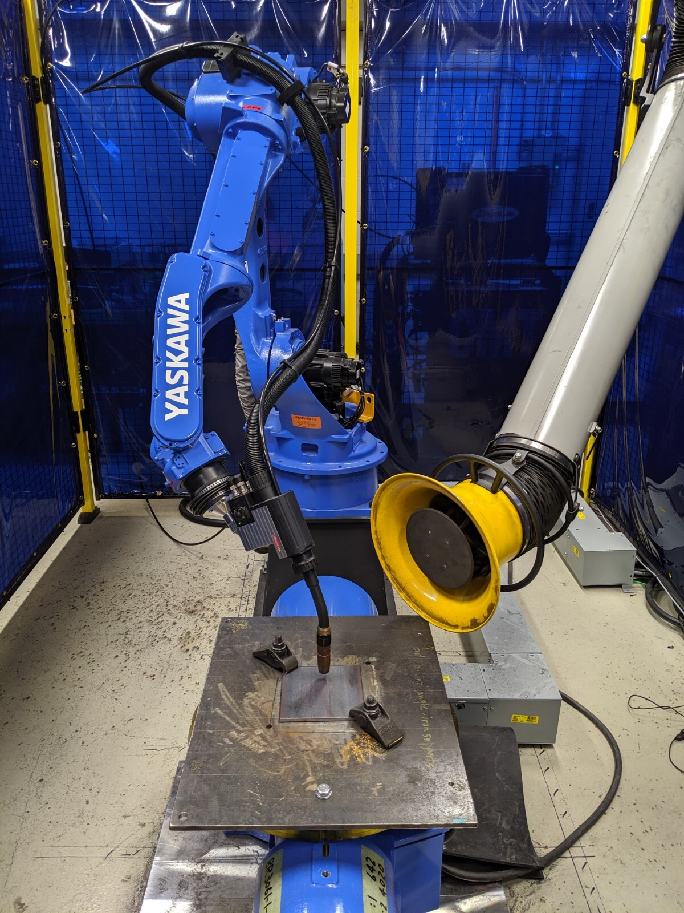
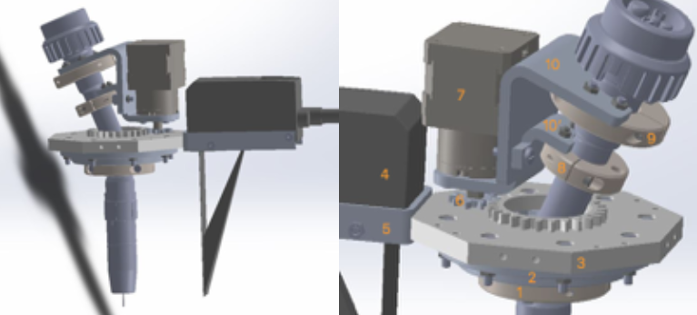
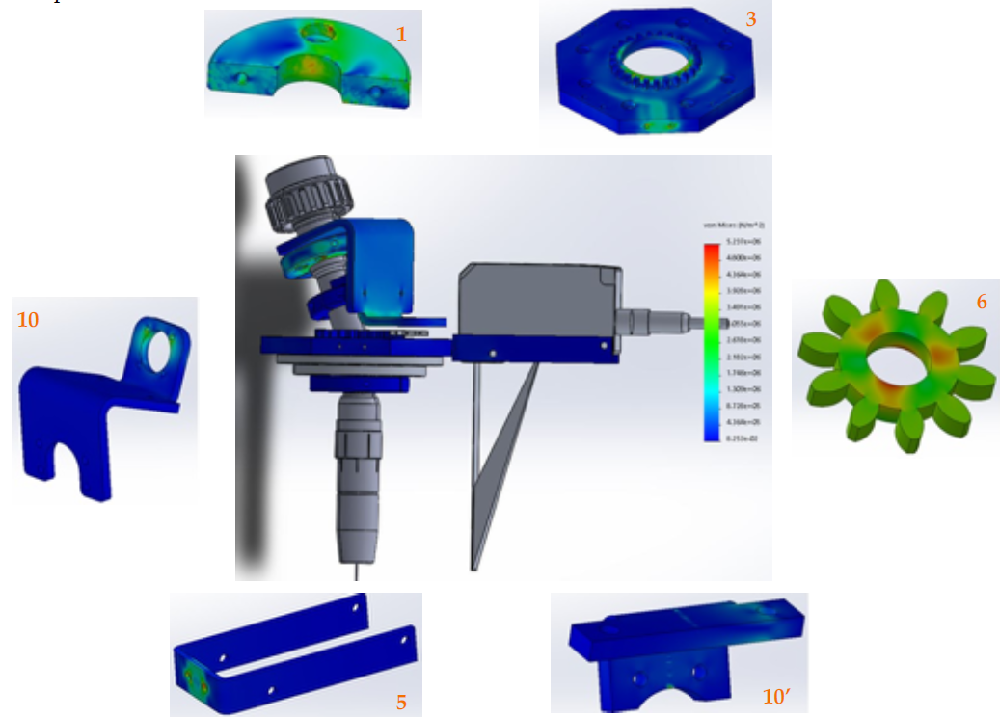
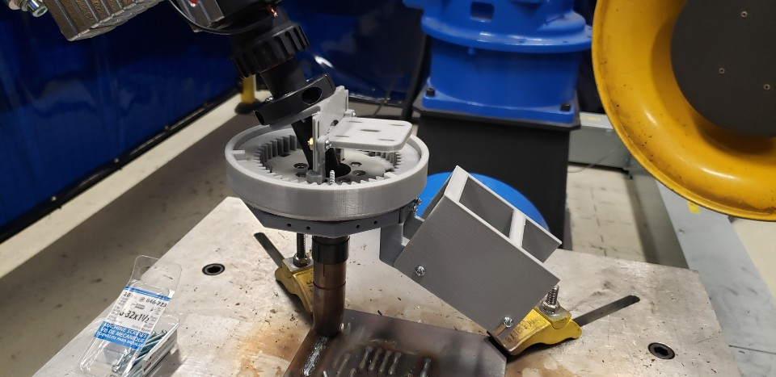
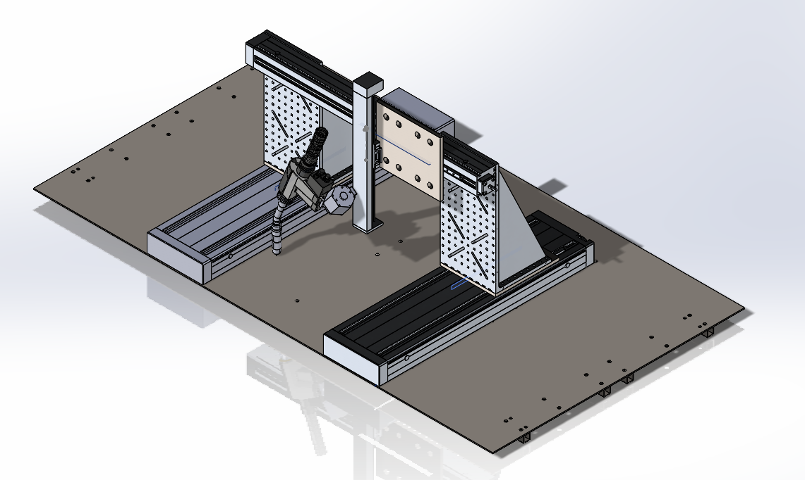
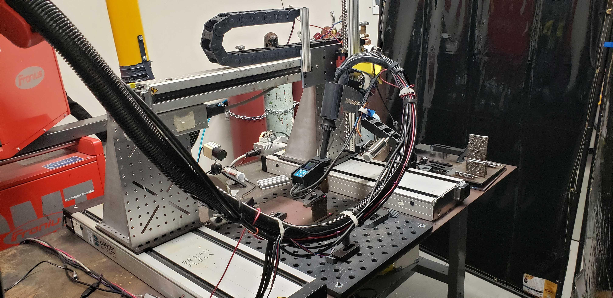
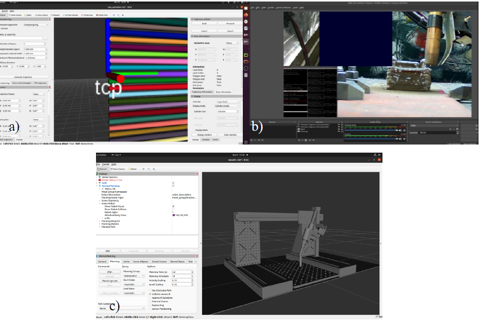
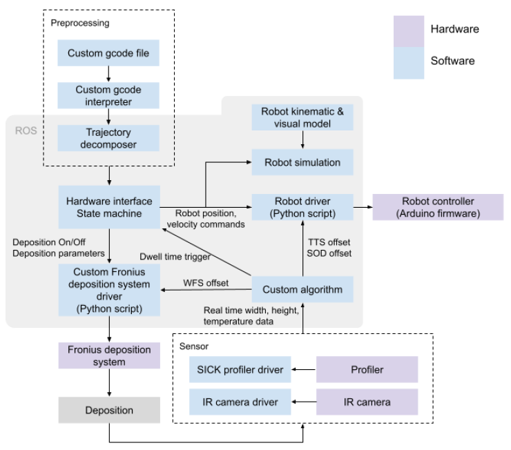

Brief rundown of process of closed loop metal 3D printing project

# Metal3DPrinting

**Goal:**

    Enable inteligent closed-loop control on robotic metal 3D printing process in real-time to improve printed part's quality

**Requirements & Process:**

    Part1: Mechanical design of sensor mounts to dynamicaly measure printed parts in various angles in real-time.
    Part2: Enable serial communication with sensors
    Part3: Software/ROS integration of profiler and IR camera to the printing process workflow.
    Part4: Measure performance and iterate on improvement

## Part1: Mechanical Design, Modeling and Prototype

### Rotating Sensor mounts
Initial prototyping, mounts to be attached near torch/tooltip 

Finite Element Analysis passed with acceptable factor: 

Number of iterative design cycles later:  
- Motor mount height is adjustable
- Profiler mount angle is adjustable for accurate reading
- Optic filter slots to protect profiler from intense infrared radiation from CMT printing process  

### 3-Axis Gantry system
Other than above Yaskawa robot, another in-house machine was built from scratch  

## Part2 & 3: Serial Communication and workflow integration

<a href='https://cdn.sick.com/media/docs/5/35/535/operating_instructions_profiler_2_short_range_distance_sensor_en_im0056535.pdf'> SICK profiler's manual </a> pg. 111 (section 8. Serial Communication) was referenced and developed a driver that interfaces with the process and the sensors. IR camera was used as well.

  
Closed loop feedback loop workflow is achieved by streaming sensory data into ML/RL algorithms which will signal welding unit and robot to change their operating parameters such as power, feedrate and etc., and trajectory and travel speed to rectify errors + learn from historical prints (markov descision process or MDP) to output parts with improved quality.  

*- The full framework is **not** available in this repo.*

## Part4: Measure, Validate and Improve
Printing metal is an expensive process. Therefore, I developed customized simulations of the process environments with usage of numerous self-made<a href='https://github.com/kwak9601/Qlearning_OpenAI'> Machine Learning/Reinforcement Learning algorithms</a> and more advanced up-to-date algorithms from<a href='https://github.com/openai/baselines'> OpenAI's stablebaselines</a>.

My custom algorithm - Reinforced inverse supervised learning control, with approximately 700 layers were used to pretrain network with Keras - The standard deviation of sequential print layers significantly improved, as well as its tracking performance.

